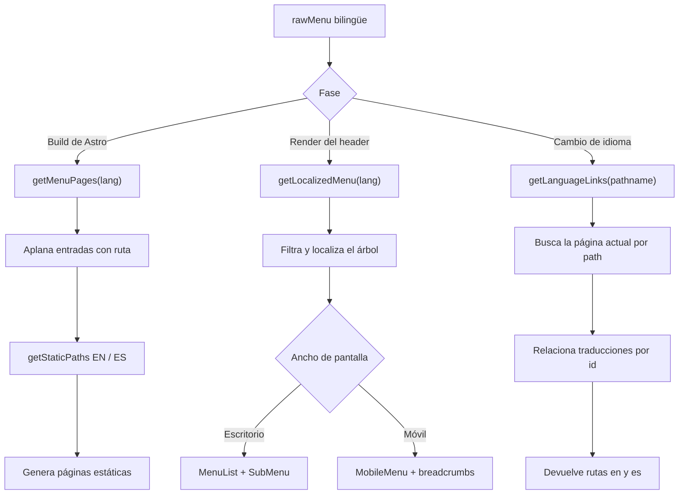

# dataMares Astro

Sitio web estático bilingüe de **dataMares**, construido con Astro, React y Tailwind CSS. El proyecto genera páginas en inglés y español desde un único árbol de navegación, incorpora metadatos SEO/Open Graph y ofrece menús adaptados para escritorio y dispositivos móviles.

## Tecnologías

- [Astro 7](https://docs.astro.build/) para rutas, layouts y generación estática.
- [React 19](https://react.dev/) para el header y los elementos interactivos.
- [Tailwind CSS 4](https://tailwindcss.com/) mediante el plugin oficial de Vite.
- [Heroicons](https://heroicons.com/) para iconos de navegación.
- i18n nativo de Astro con inglés como idioma predeterminado y español bajo `/es`.

## Requisitos

- Node.js `>=22.12.0`.
- npm, incluido con Node.js.
- Git para clonar y versionar el proyecto.

El proyecto no requiere variables de entorno para ejecutarse localmente.

## Instalación

```bash
git clone <URL_DEL_REPOSITORIO>
cd dM-Astro
npm install
```

Inicia el servidor de desarrollo en segundo plano:

```bash
npm run astro -- dev --background
```

Administra el proceso con:

```bash
npm run astro -- dev status
npm run astro -- dev logs
npm run astro -- dev stop
```

La URL predeterminada es `http://localhost:4321`.

## Comandos disponibles

| Comando                             | Descripción                                            |
| ----------------------------------- | ------------------------------------------------------ |
| `npm run astro -- dev --background` | Inicia el servidor de desarrollo en segundo plano.     |
| `npm run astro -- dev status`       | Muestra el estado del servidor de desarrollo.          |
| `npm run astro -- dev logs`         | Consulta los logs del servidor en segundo plano.       |
| `npm run astro -- dev stop`         | Detiene el servidor de desarrollo.                     |
| `npm run build`                     | Genera el sitio estático en `dist/`.                   |
| `npm run preview`                   | Publica el build local en todas las interfaces de red. |
| `npm run astro -- --help`           | Muestra la ayuda de Astro CLI.                         |

## Estructura del proyecto

```text
.
├── public/                    # Logos, favicons y banderas públicas
├── src/
│   ├── Assets/                # Componentes React de iconos
│   ├── components/
│   │   ├── Header/            # Navegación, datos i18n y menú responsive
│   │   └── SimpleMenuPage.astro
│   ├── layouts/Layout.astro   # HTML base, SEO y header hidratado
│   ├── locales/               # JSON de idiomas reservado para contenido
│   ├── pages/                 # Inicio y rutas dinámicas EN/ES
│   └── styles/global.css      # Tailwind y estilos globales
├── astro.config.mjs           # React, Tailwind e i18n
└── package.json
```

## Ejemplos de uso

### 1. Básico: ejecutar y validar el sitio

```bash
npm install
npm run astro -- dev --background
npm run astro -- dev status
```

Abre `/` para inglés o `/es` para español. Antes de entregar cambios, genera el sitio completo:

```bash
npm run build
```

### 2. Intermedio: agregar una página bilingüe

Añade una entrada al arreglo `rawMenu` de `src/components/Header/menuData.js`:

```js
{
  id: "projects",
  label: { en: "Projects", es: "Proyectos" },
  page: { en: "projects", es: "proyectos" },
}
```

No es necesario crear dos archivos de página. Durante el build, `getMenuPages("en")` y `getMenuPages("es")` alimentan las rutas dinámicas `src/pages/[slug].astro` y `src/pages/es/[slug].astro`. Se generarán automáticamente:

```text
/projects
/es/proyectos
```

El selector de idioma relacionará ambas páginas mediante el `id` estable `projects`.

### 3. Avanzado: consumir la API de navegación

Las utilidades se pueden reutilizar desde componentes o scripts internos:

```js
import { getLanguageLinks, getLocalizedMenu, getMenuPages } from "./src/components/Header/menuData.js";

const spanishTree = getLocalizedMenu("es");
const englishRoutes = getMenuPages("en");
const translations = getLanguageLinks("/marine-prosperity-areas");

console.log(spanishTree);
console.log(englishRoutes.map(({ path }) => path));
console.log(translations);
// { en: "/marine-prosperity-areas", es: "/es/areas-de-prosperidad-maritima" }
```

Al extender esta lógica, conserva el mismo `id` entre idiomas. `getLanguageLinks` usa ese identificador, no el slug, para encontrar la página equivalente.

## Arquitectura y flujo principal

El árbol `rawMenu` es la fuente de verdad para etiquetas, slugs, jerarquía y equivalencias entre idiomas.



## Referencia de API

Esta es una API interna del proyecto; los módulos no se publican actualmente como paquete npm.

| Export                | Archivo                                | Parámetros / props                             | Retorno                      | Errores relevantes                                                       |
| --------------------- | -------------------------------------- | ---------------------------------------------- | ---------------------------- | ------------------------------------------------------------------------ |
| `getLocalizedMenu`    | `Header/menuData.js`                   | `lang?: "en" \| "es"`, `items?: RawMenuItem[]` | `LocalizedMenuItem[]`        | `TypeError` si `items` no permite `map`.                                 |
| `getMenuPages`        | `Header/menuData.js`                   | `lang?`, `items?`, `parentLabels?`             | `MenuPage[]`                 | `TypeError` si las colecciones no son iterables o no permiten `flatMap`. |
| `getLanguageLinks`    | `Header/menuData.js`                   | `currentPath?: string`                         | `{ en: string, es: string }` | `TypeError` si `currentPath` no es texto.                                |
| `Header`              | `Header/Header.jsx`                    | `lang?`, `pathname?`                           | Elemento React               | Puede propagar errores de datos o pathname inválidos.                    |
| `SocialIcons`         | `Header/SocialIcons.jsx`               | Sin props                                      | Elemento React               | No lanza errores intencionalmente.                                       |
| `MenuList`            | `Header/ui/MenuList.jsx`               | `menu`, `className?`, `listClassName?`         | Elemento React               | `TypeError` si `menu` no permite `map`.                                  |
| `MobileMenu`          | `Header/ui/MobileMenu.jsx`             | `languageLinks`, `menu`                        | Elemento React               | `TypeError` si el árbol no permite `map`.                                |
| `SubMenu`             | `Header/ui/SubMenu.jsx`                | `label`, `children`, `bgColor?`, `nested?`     | Elemento React               | Una clave `bgColor` desconocida omite las clases de interacción.         |
| `Link`                | `Header/ui/Link.jsx`                   | `label`, `page`, `bgHover`, `scientificName?`  | Elemento React               | Props ausentes pueden producir un enlace incompleto.                     |
| `renderMenuItem`      | `Header/ui/helpers/renderMenuItem.jsx` | `item`, `nested?`                              | Nodo React o `null`          | `TypeError` si `submenu` no permite `map`.                               |
| `FacebookIcon`        | `Assets/FacebookIcon.jsx`              | `link`, `size`                                 | Elemento React               | Props ausentes producen un enlace o tamaño inválido.                     |
| `InstagramIcon`       | `Assets/InstagramIcon.jsx`             | `link`, `size`                                 | Elemento React               | Props ausentes producen un enlace o tamaño inválido.                     |
| `MailIcon`            | `Assets/MailIcon.jsx`                  | `link`, `size`                                 | Elemento React               | Props ausentes producen un enlace o tamaño inválido.                     |
| `TableuIcon`          | `Assets/TableuIcon.jsx`                | `link`                                         | Elemento React               | Un `link` ausente produce un destino inválido.                           |
| `TwitterIcon`         | `Assets/TwitterIcon.jsx`               | `link`, `size`                                 | Elemento React               | Props ausentes producen un enlace o tamaño inválido.                     |
| `ViewPort`            | `components/ViewPort.jsx`              | Sin props                                      | Elemento React               | `ReferenceError` fuera del navegador; debe usarse con `client:only`.     |
| `getStaticPaths` (EN) | `pages/[slug].astro`                   | Sin parámetros                                 | Rutas estáticas Astro        | Propaga errores de `getMenuPages`.                                       |
| `getStaticPaths` (ES) | `pages/es/[slug].astro`                | Sin parámetros                                 | Rutas estáticas Astro        | Propaga errores de `getMenuPages`.                                       |

### Contratos de componentes Astro

| Componente             | Props                                           | Función                                                  |
| ---------------------- | ----------------------------------------------- | -------------------------------------------------------- |
| `Layout.astro`         | `title?`, `description?`, `image?`, `type?`     | Define el documento, SEO, Open Graph y monta el header.  |
| `SimpleMenuPage.astro` | `title`, `section?`, `scientificName?`, `lang?` | Renderiza el contenido provisional de una ruta del menú. |

## Internacionalización

`astro.config.mjs` declara `en` como locale predeterminado y `es` como locale con prefijo. La navegación no depende actualmente de `src/locales/*.json`; sus textos y slugs viven en `rawMenu`.

Reglas importantes:

1. Usa un `id` único y estable para cada concepto.
2. Agrega `label.en`/`label.es` y `page.en`/`page.es` cuando cambien entre idiomas.
3. Si una entrada solo existe en un idioma, omite el otro valor; el menú la filtrará para ese locale.
4. Los slugs no deben incluir `/` ni el prefijo `/es`; `buildPath` los agrega.

## Troubleshooting

### El servidor no inicia o el puerto 4321 está ocupado

Comprueba si ya existe un proceso en segundo plano:

```bash
npm run astro -- dev status
npm run astro -- dev logs
```

Detén el proceso anterior con `npm run astro -- dev stop` y vuelve a iniciarlo.

### `npm install` falla por la versión de Node.js

Verifica `node --version`. Este repositorio requiere Node.js `>=22.12.0`. Actualiza Node con tu administrador de versiones y vuelve a ejecutar `npm install`.

### Una página nueva no aparece en el build

Confirma que la entrada de `rawMenu` tenga `label` y `page` para el idioma esperado. `getMenuPages` omite entradas sin alguno de esos campos. Después ejecuta `npm run build` y revisa la lista de rutas generadas.

### El selector de idioma envía al inicio

Esto ocurre cuando la ruta actual no está en `rawMenu` o cuando los idiomas usan IDs distintos. Usa exactamente el mismo `id` para las dos versiones. Las rutas desconocidas caen de forma segura en `/` y `/es`.

### Las banderas o imágenes funcionan en macOS pero fallan al desplegar

Los sistemas Linux distinguen mayúsculas y minúsculas. Las rutas deben respetar el directorio `public/Flags`, por ejemplo `/Flags/MX.svg` y `/Flags/US.svg`.

### El menú móvil no responde

El header se hidrata con `client:load` desde `Layout.astro`. Comprueba que la integración `@astrojs/react` siga configurada y revisa la consola del navegador para detectar errores de hidratación.

### `ViewPort` produce `window is not defined`

`ViewPort` accede a `window` al inicializarse. Móntalo únicamente como isla de cliente con `client:only`, tal como se hace en `Layout.astro`.

### Las clases dinámicas de Tailwind no se generan

Evita construir nombres de utilidades con valores arbitrarios en tiempo de ejecución. Mantén las clases posibles como cadenas completas presentes en el código fuente para que Tailwind pueda detectarlas durante el build.

## Validación antes de un commit

```bash
npm run build
git status --short
git diff --check
```

El build debe completar las rutas inglesas y españolas sin errores.
