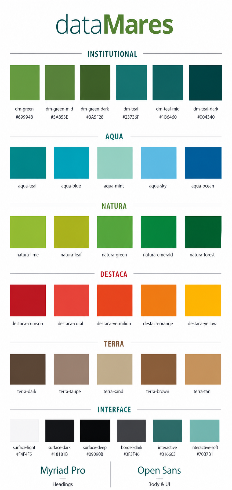

# Identidad visual dataMares



Esta guía combina el manual institucional de dataMares, la interfaz actual del sitio y los colores necesarios para los temas claro y oscuro. Los valores del manual fueron extraídos directamente del PDF vectorial. Los nombres `dm-*` de las tablas son referencias del manual, no utilidades de Tailwind.

## Identidad institucional

| Token | Hex | RGB | Uso recomendado |
| --- | --- | --- | --- |
| `dm-green` | `#699948` | `rgb(105, 153, 72)` | Verde principal del logotipo y acentos de marca. |
| `dm-green-mid` | `#5A853E` | `rgb(90, 133, 62)` | Hover, gráficos y variación intermedia. |
| `dm-green-dark` | `#3A5F28` | `rgb(58, 95, 40)` | Contraste institucional sobre fondos claros. |
| `dm-teal` | `#23736F` | `rgb(35, 115, 111)` | Turquesa principal del logotipo, títulos y aguijones. |
| `dm-teal-mid` | `#1B6460` | `rgb(27, 100, 96)` | Hover, navegación y elementos secundarios. |
| `dm-teal-dark` | `#004340` | `rgb(0, 67, 64)` | Fondos institucionales, footer y bloques destacados. |

## Paleta Aqua

| Token | Hex | RGB |
| --- | --- | --- |
| `dm-aqua-teal` | `#00A79D` | `rgb(0, 167, 157)` |
| `dm-aqua-teal-mid` | `#028C9E` | `rgb(2, 140, 158)` |
| `dm-aqua-teal-dark` | `#01789E` | `rgb(1, 120, 158)` |
| `dm-aqua-blue` | `#27AAE1` | `rgb(39, 170, 225)` |
| `dm-aqua-mint` | `#8ACEAE` | `rgb(138, 206, 174)` |
| `dm-aqua-sky` | `#59C9E5` | `rgb(89, 201, 229)` |
| `dm-aqua-ocean` | `#01649C` | `rgb(1, 100, 156)` |

Usar Aqua para contenido relacionado con océanos, datos, agua, vínculos informativos y visualizaciones científicas.

## Paleta Natura

| Token | Hex | RGB |
| --- | --- | --- |
| `dm-natura-lime` | `#D7DF23` | `rgb(215, 223, 35)` |
| `dm-natura-lime-mid` | `#B0B91D` | `rgb(176, 185, 29)` |
| `dm-natura-lime-dark` | `#8B9414` | `rgb(139, 148, 20)` |
| `dm-natura-leaf` | `#8DC63F` | `rgb(141, 198, 63)` |
| `dm-natura-leaf-mid` | `#73A533` | `rgb(115, 165, 51)` |
| `dm-natura-leaf-dark` | `#598527` | `rgb(89, 133, 39)` |
| `dm-natura-green` | `#39B54A` | `rgb(57, 181, 74)` |
| `dm-natura-green-mid` | `#2C973E` | `rgb(44, 151, 62)` |
| `dm-natura-green-dark` | `#197B30` | `rgb(25, 123, 48)` |
| `dm-natura-emerald` | `#009444` | `rgb(0, 148, 68)` |
| `dm-natura-emerald-mid` | `#007B38` | `rgb(0, 123, 56)` |
| `dm-natura-emerald-dark` | `#006129` | `rgb(0, 97, 41)` |
| `dm-natura-forest` | `#006838` | `rgb(0, 104, 56)` |
| `dm-natura-forest-mid` | `#005129` | `rgb(0, 81, 41)` |
| `dm-natura-forest-dark` | `#003A17` | `rgb(0, 58, 23)` |

Usar Natura para biodiversidad, conservación, estados positivos, categorías ecológicas y gráficas ambientales.

## Paleta Destaca

| Token | Hex | RGB |
| --- | --- | --- |
| `dm-destaca-crimson` | `#BE1E2D` | `rgb(190, 30, 45)` |
| `dm-destaca-coral` | `#EF4136` | `rgb(239, 65, 54)` |
| `dm-destaca-vermilion` | `#F15A29` | `rgb(241, 90, 41)` |
| `dm-destaca-orange` | `#F7941D` | `rgb(247, 148, 29)` |
| `dm-destaca-yellow` | `#FFC20E` | `rgb(255, 194, 14)` |

Usar Destaca con moderación para alertas, cifras prioritarias, llamadas editoriales y estados que necesitan atención. El amarillo requiere texto oscuro para conservar contraste.

## Paleta Terra

| Token | Hex | RGB |
| --- | --- | --- |
| `dm-terra-dark` | `#594A42` | `rgb(89, 74, 66)` |
| `dm-terra-taupe` | `#9B8579` | `rgb(155, 133, 121)` |
| `dm-terra-sand` | `#C2B59B` | `rgb(194, 181, 155)` |
| `dm-terra-brown` | `#8B5E3C` | `rgb(139, 94, 60)` |
| `dm-terra-tan` | `#C49A6C` | `rgb(196, 154, 108)` |

Usar Terra en categorías terrestres, mapas, fondos editoriales cálidos y visualizaciones de suelo o territorio.

## Colores de interfaz y temas

| Token | Hex | RGB | Uso recomendado |
| --- | --- | --- | --- |
| `dm-interactive` | `#316663` | `rgb(49, 102, 99)` | Enlaces, iconos y controles principales. |
| `dm-interactive-soft` | `#70B7B1` | `rgb(112, 183, 177)` | Hover, foco y controles sobre fondos oscuros. |
| `dm-surface-light` | `#F4F4F5` | `rgb(244, 244, 245)` | Header y superficies del tema claro. |
| `dm-border-light` | `#E4E4E7` | `rgb(228, 228, 231)` | Bordes del tema claro. |
| `dm-text-light` | `#18181B` | `rgb(24, 24, 27)` | Texto principal del tema claro. |
| `dm-surface-dark` | `#18181B` | `rgb(24, 24, 27)` | Superficie principal del tema oscuro. |
| `dm-surface-deep` | `#09090B` | `rgb(9, 9, 11)` | Menús, overlays y profundidad en tema oscuro. |
| `dm-border-dark` | `#3F3F46` | `rgb(63, 63, 70)` | Bordes del tema oscuro. |

### Tema claro

- Fondo general blanco o `zinc-100`.
- Texto principal `zinc-900`.
- Bordes `zinc-200`.
- Acción principal `teal-700`; hover y foco `teal-300`.

### Tema oscuro

- Fondo general `zinc-900`; capas profundas `zinc-950`.
- Texto blanco o zinc claro.
- Bordes `zinc-700`.
- Acción principal `teal-300`; fondos activos `teal-700`.

## Tipografía

| Familia | Uso web |
| --- | --- |
| **Myriad Pro** | Logotipo, titulares, subtítulos, números grandes y piezas editoriales. |
| **Open Sans** | Párrafos, formularios, botones, etiquetas, navegación y contenido de interfaz. |

El manual utiliza Myriad Pro Bold Condensed en altas para títulos de 22 a 30 pt y subtítulos de 12 pt; Myriad Pro Semibold para introducciones de 10 pt; Myriad Pro Regular para contenido de 8 pt y notas de 7 pt. En web se deben conservar esas proporciones mediante `rem` y `clamp()`, no copiar directamente los puntos impresos.

Las familias están disponibles como tokens de Tailwind:

```html
<h1 class="font-myriad text-4xl font-semibold uppercase">Título editorial</h1>
<h2 class="font-myriad-condensed text-3xl font-bold uppercase">Subtítulo condensado</h2>
<p class="font-open-sans text-base">Contenido del sitio</p>
```

Myriad Pro se carga localmente desde `public/fonts/` con estas variantes:

| Utilidad | Archivo | Peso |
| --- | --- | --- |
| `font-myriad` | `MYRIADPRO-REGULAR.OTF` | 400 Regular |
| `font-myriad` | `MYRIADPRO-SEMIBOLD.OTF` | 600 Semibold |
| `font-myriad-condensed` | `MYRIADPRO-BOLDCOND.OTF` | 700 Bold Condensed |

Open Sans no tiene un archivo local en el proyecto todavía. La utilidad `font-open-sans` usa Open Sans cuando esté instalada o cargada por otro medio y, mientras tanto, utiliza Arial como respaldo.

## Reglas de uso

- Usar los colores institucionales para marca y estructura; las familias Aqua, Natura, Destaca y Terra clasifican contenido.
- No usar más de dos acentos fuertes dentro del mismo bloque.
- No usar los tonos aqua claros, arena o amarillo para texto pequeño sobre blanco.
- Los estados de foco deben incluir contorno, subrayado o cambio de forma además del color.
- Sobre fotografías, usar controles blancos y una sombra o capa de contraste cuando sea necesario.

## Uso de la paleta en Tailwind

La interfaz usa las escalas estándar de Tailwind. No hay tokens de color personalizados en `@theme`: se usan directamente utilidades `bg-*`, `text-*`, `border-*`, `fill-*`, `stroke-*`, `ring-*` y variantes como `hover:` o `dark:`.

### Referencia rápida

| Necesidad | Escala Tailwind | Ejemplo |
| --- | --- | --- |
| Marca principal verde | `green-*` | `text-green-600` |
| Marca principal turquesa | `teal-*` | `bg-teal-700` |
| Fondo institucional oscuro | `teal-*` | `bg-teal-950` |
| Enlace o control | `teal-*` | `text-teal-700` |
| Hover o foco | `teal-*` | `hover:text-teal-300` |
| Información oceánica | `sky-*` | `border-sky-500` |
| Conservación o biodiversidad | `emerald-*` | `bg-emerald-600` |
| Alerta o dato destacado | `red-*` | `text-red-500` |
| Contenido terrestre | `stone-*` | `bg-stone-600` |
| Superficie clara | `zinc-*` | `bg-zinc-100` |
| Superficie oscura | `zinc-*` | `dark:bg-zinc-900` |
| Borde según tema | `zinc-*` | `border-zinc-200 dark:border-zinc-700` |

### Ejemplos

```html
<section class="bg-zinc-100 text-zinc-900 dark:bg-zinc-900 dark:text-white">
  <h2 class="font-myriad text-teal-700 dark:text-teal-300">
    Biodiversidad marina
  </h2>
  <p class="font-open-sans">Contenido editorial.</p>
</section>
```

```html
<a
  class="font-open-sans text-teal-700 underline decoration-transparent transition-colors hover:text-teal-300 hover:decoration-current focus:ring-2 focus:ring-teal-300"
>
  Ver publicación
</a>
```

Se puede aplicar opacidad con la sintaxis normal de Tailwind, por ejemplo `bg-teal-700/80`, `stroke-teal-300/70` o `border-green-600/40`.
